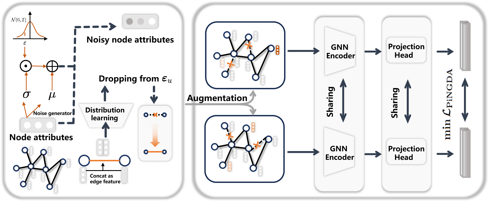

# Learn Beneficial Noise as Graph Augmentation

[](https://arxiv.org/abs/2505.19024)



## Task Overview

This project includes two types of tasks:

### 1. Node Classification  
- Main file: `train.py`  
- Dependency: `torch_geometric==2.6.0`

### 2. Graph Classification (TU datasets)  
- Files prefixed with `tu_`, such as `tu_train.py`, `tu_dataset.py`, etc.  
- Dependency: `torch_geometric==2.4.0`

---

## Dependencies

General dependencies:

```txt
numpy==2.2.2
scipy==1.11.4
torch==2.5.1
ogb==1.3.6
```

### **Run** 

Node classification:

```bash
python train.py --learnable_edge_drop --learnable_feat_drop
```

Graph classification (TU datasets):

```bash
python tu_train.py --learnable_edge_drop --learnable_feat_drop
```

### **Key Args**

```bash
--dataset: dataset name (e.g., Cora)

--lr: learning rate

--epoch: number of epochs

--learnable_edge_drop: enable learnable edge noise

--learnable_feat_drop: enable learnable feature noise
```